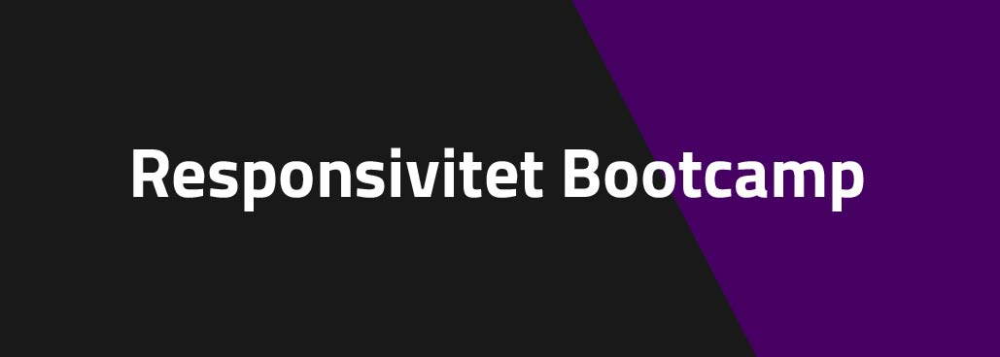
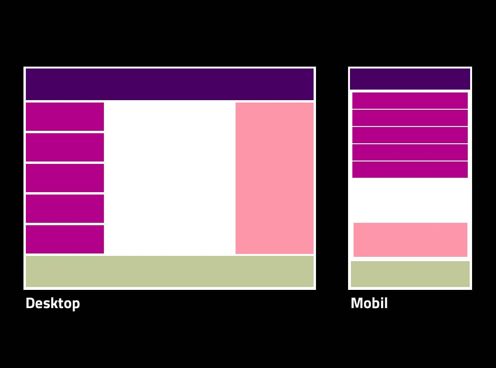
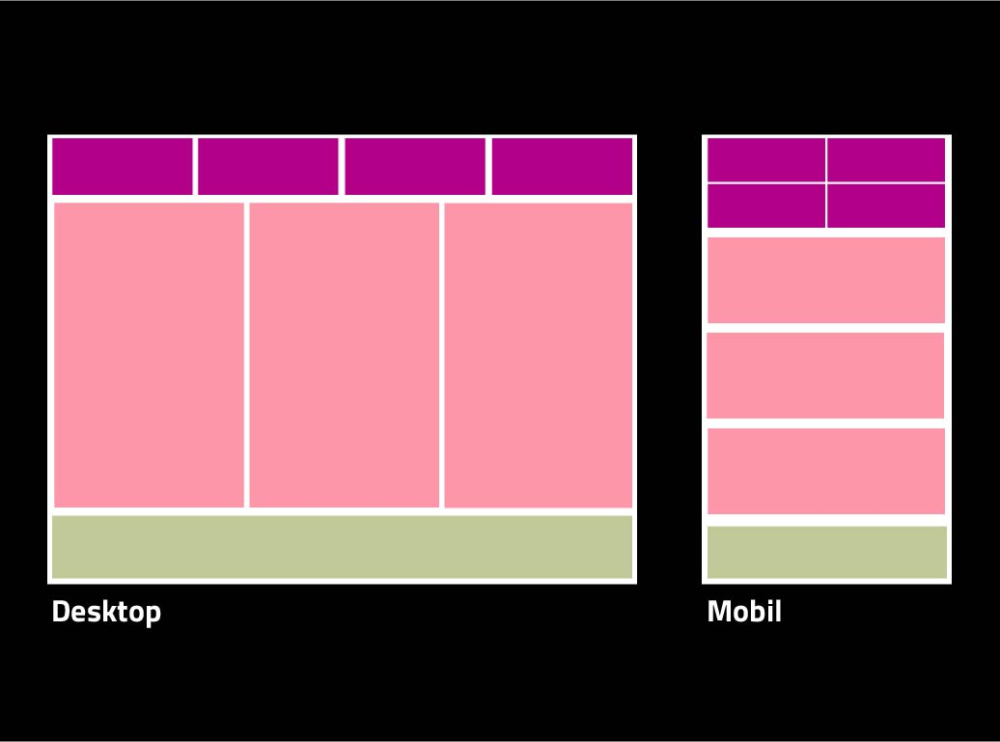
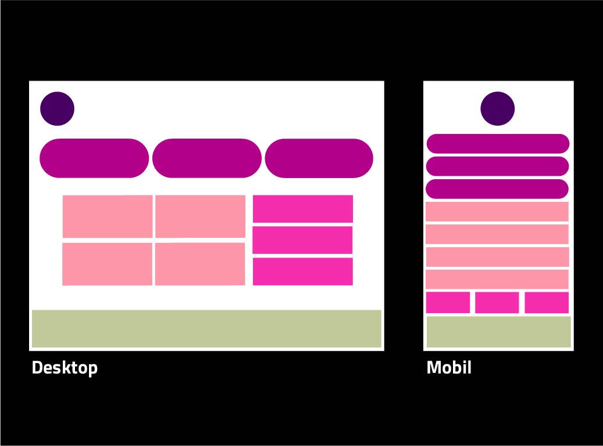
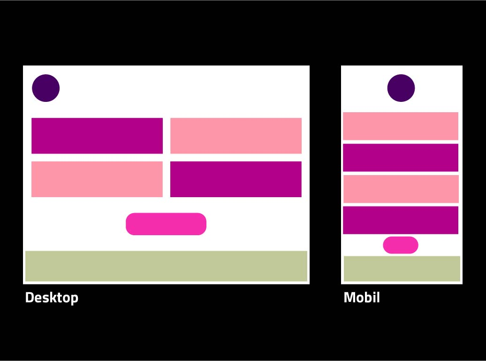

# Responsivitet Bootcamp
**En hög med övningar för att träna på responsivitet.**

### Testa att använda både Flexbox, CSS grid och vanilla CSS (inga bibliotek eller preprocessorer så som Bootstrap eller SASS etc) på varje övning.

## Övning 1

## Övning 2

## Övning 3

## Övning 4

